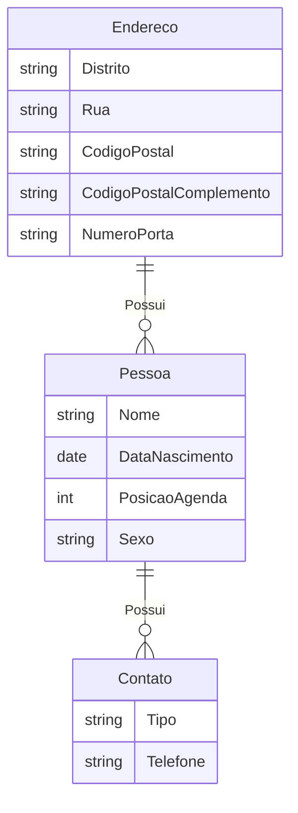

# O Modelo Relacional
## Escolher um Domínio de Aplicação
- Agenda de Contatos
## Entidades
- Pessoas
- Contatos
- Endereços
## Relações
- Pessoa tem vários contatos
- Endereço pode abrigar várias pessoas

## Modelo Lógico

## Modelo Físico

[Script - Modelo Físico](https://github.com/RumosProjetos/Acao74240/blob/main/AcessoADados/Aula01/AgendaContatos.sql)
