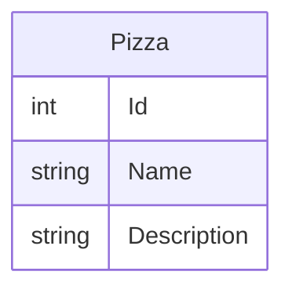

# EntityFramework DatabaseFirst
- Introdução: https://docs.microsoft.com/en-us/learn/modules/build-web-api-minimal-database/ 
## Comandos utilizados 
- dotnet add package Microsoft.EntityFrameworkCore.InMemory --version 6.0
- dotnet add package Microsoft.EntityFrameworkCore.Sqlite --version 6.0
- dotnet tool install --global dotnet-efdotnet add package Microsoft.EntityFrameworkCore.Design --version 6.0
- dotnet add package Microsoft.EntityFrameworkCore.Design --version 6.0
- dotnet ef migrations add InitialCreate
- dotnet ef database update --context PizzaContext

## Como mapear os modelos

## Modelo Lógico

