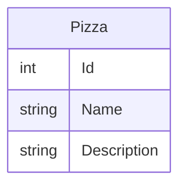

# EntityFramework DatabaseFirst
- Introdução: https://docs.microsoft.com/en-us/learn/modules/build-web-api-minimal-database/ 
- Como mapear os modelos

## Modelo Lógico

```mermaid
erDiagram
    Pizza {
        int Id
        string Name
        string Description         
    }
```
